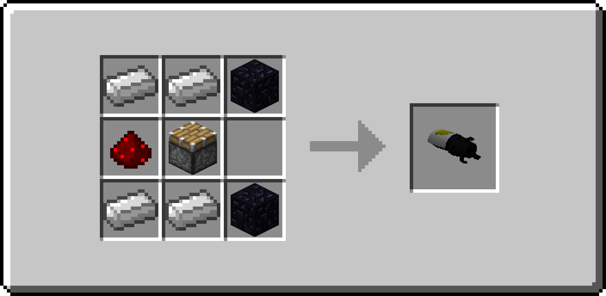
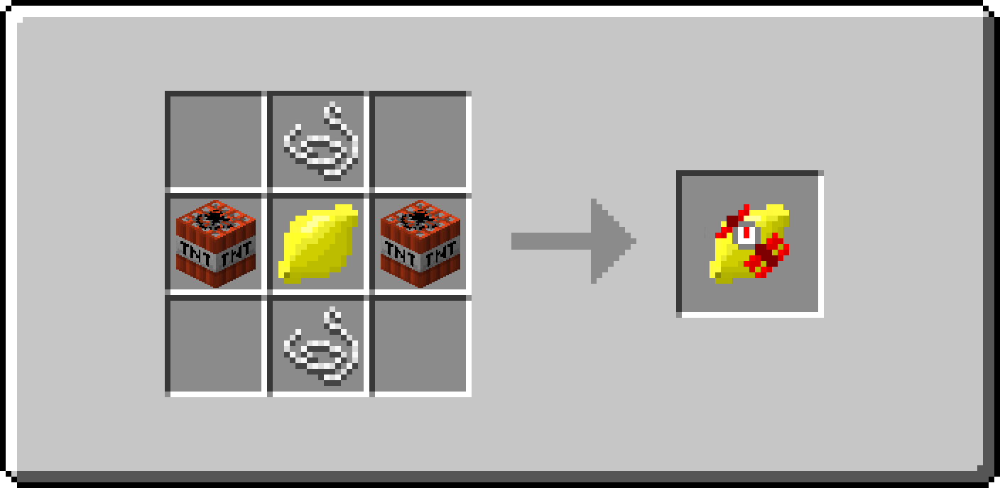
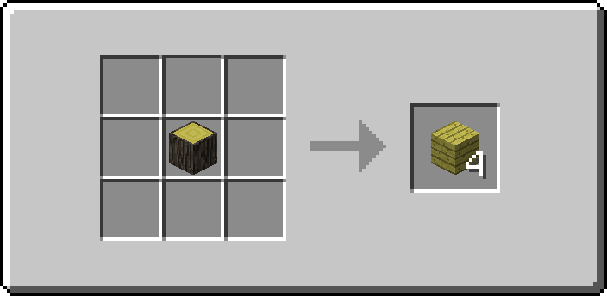

Combustible Lemon Launcher
==========================

__The official Git-Repository!__

Adds a combustible lemon launcher to Minecraft inspired by [Portal 2](http://thinkwithportals.com/). 
Feel free to submit issues & improvements using GitHubs Issue Tracker  and Pull Requests . 
 
Link to [Curse Forge Post](http://minecraft.curseforge.com/mc-mods/combustible-lemon-launcher/)

### Crafting

the Combustible Lemon Launcher: 

the Explosive Lemon: 

the Lemon Tree Planks: 

_(Lemon Tree Planks and Lemon Tree Logs are registered to the OreDictionary)_

###### Lemon Trees

Lemon Trees spawn randomly in newly generated chunks. There's a config option to disable the spawning (requires restart) and they behave just like normal trees: they decay, drop saplings, can be planted and be used by bone meal. 
Lemon Trees come with normal leaves and lemon leaves. Lemon Leaves drop the Lemon Item, which is edible. Lemons are registered to the OreDictionary as ``foodLemon``